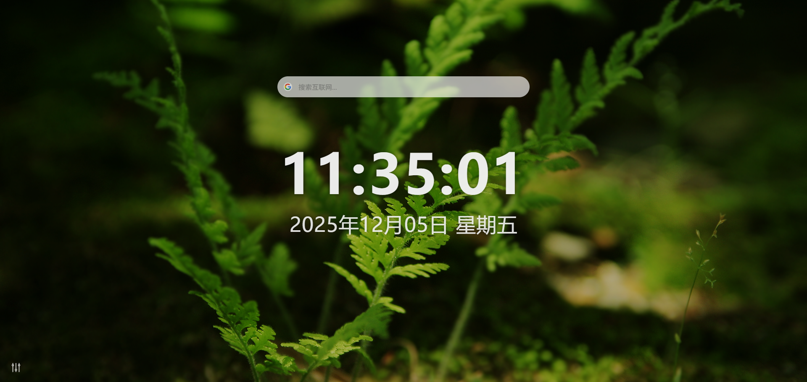

# 极简新标签页

一款极简、高性能、高颜值的 Chrome / Edge 新标签页扩展，旨在提供无干扰、美观且实用的起始页体验。



## ✨ 功能特性

### 🕐 实时时钟显示

- 精确到秒的时间显示（HH:mm:ss 格式）
- 完整日期显示（YYYY 年 MM 月 DD 日 星期 X）
- 自动更新，无需刷新

### 🔍 智能搜索

- 支持多个主流搜索引擎：Google、Bing、百度、DuckDuckGo
- 可自定义添加搜索引擎
- Tab 键快速切换搜索引擎（可配置）
- 支持新标签页或当前标签页打开搜索结果

### 🖼️ 壁纸系统

- 支持本地上传壁纸（JPG/PNG/WebP）
- 可调节壁纸模糊强度（0-20px）
- 可调节遮罩透明度（0.0-0.8）
- 壁纸设置自动保存，浏览器重启后保持

### 🎨 主题切换

- 跟随系统主题（自动切换）
- 浅色主题
- 深色主题
- 主题状态永久保存

### ⚙️ 个性化设置

- 搜索框宽度调节（400px-900px）
- 搜索框透明度调节（0.2-1.0）
- 搜索打开方式选择
- Tab 键切换搜索引擎开关

## 🚀 安装方法

### 从源码安装

1. 克隆或下载本项目到本地
2. 打开 Chrome 浏览器，访问 `chrome://extensions/`
3. 开启右上角的"开发者模式"
4. 点击"加载已解压的扩展程序"
5. 选择项目根目录
6. 扩展安装完成，打开新标签页即可体验

### Edge 浏览器安装

1. 打开 Edge 浏览器，访问 `edge://extensions/`
2. 开启左下角的"开发人员模式"
3. 点击"加载解压缩的扩展"
4. 选择项目根目录
5. 扩展安装完成

## 📁 项目结构

```
/tab-extension
├── manifest.json                # 扩展核心配置文件 (MV3)
├── newtab.html                  # 新标签页入口文件
├── styles/                      # 样式文件夹
│   ├── main.css                 # 全局重置与基础布局
│   ├── theme.css                # 主题变量定义 (Light/Dark)
│   ├── settings.css             # 设置抽屉与控件样式
│   ├── wallpaper.css            # 壁纸与背景层样式
│   └── components.css           # 搜索框、时钟等组件样式
├── scripts/                     # 逻辑文件夹
│   ├── main.js                  # 入口脚本，负责初始化与模块协调
│   ├── clock.js                 # 时间日期模块
│   ├── search.js                # 搜索功能与跳转逻辑
│   ├── settings.js              # 设置面板 UI 交互与事件绑定
│   ├── theme.js                 # 主题切换逻辑
│   ├── wallpaper.js             # 壁纸上传、渲染与样式应用
│   ├── engines.js               # 搜索引擎管理逻辑
│   └── storage.js               # 数据存储封装层
├── assets/                      # 静态资源
│   ├── icons/                   # 扩展图标 (16, 48, 128)
│   └── ui/                      # UI 图标 (SVG)
├── docs/                        # 文档
│   ├── design_specs.md          # 设计规范文档
│   └── deployment.md            # 打包与发布说明
└── background.js                # 后台服务 (Service Worker)
```

## 🛠️ 技术栈

- **核心规范**: Manifest V3 (Chrome & Edge)
- **编程语言**: 原生 HTML5, CSS3, JavaScript (ES6+)
- **样式处理**: CSS Variables, CSS Transitions, Flexbox/Grid 布局
- **数据存储**: chrome.storage.local API
- **UI 设计**: Glassmorphism 毛玻璃效果，响应式设计

## 🎯 使用指南

### 基本使用

1. **时钟显示**: 新标签页中央会自动显示当前时间和日期
2. **搜索功能**: 在顶部搜索框输入关键词，按 Enter 执行搜索
3. **设置面板**: 点击左下角齿轮图标打开设置面板

### 搜索引擎管理

1. 在设置面板中选择"搜索引擎"标签
2. 从下拉菜单中选择默认搜索引擎
3. 点击"添加自定义搜索引擎"可添加新的搜索引擎
4. 填写名称、搜索 URL（使用 %s 作为关键词占位符）和图标 URL

### 壁纸设置

1. 在设置面板中选择"壁纸"标签
2. 点击"选择文件"上传本地图片
3. 使用滑块调节模糊强度和遮罩透明度
4. 设置会自动保存并立即生效

### 主题切换

1. 在设置面板中选择"主题切换"标签
2. 选择"跟随系统"、"浅色主题"或"深色主题"
3. 主题会立即应用并保存设置

## 🔧 开发说明

### 本地开发

1. 克隆项目到本地
2. 修改代码后，在浏览器扩展管理页面点击"刷新"按钮
3. 打开新标签页查看效果

### 调试技巧

1. 使用浏览器开发者工具调试页面和脚本
2. 查看 `chrome://extensions/` 中的扩展错误日志
3. 使用 `chrome.storage.local` 查看存储数据

### 代码规范

- 使用 ES6+ 语法
- 采用模块化设计
- 遵循函数式编程原则
- 代码注释清晰完整

## 📋 更新日志

### v1.0.0 (2024-01-01)

- 🎉 首次发布
- ✨ 实时时钟显示
- ✨ 多搜索引擎支持
- ✨ 本地壁纸功能
- ✨ 主题切换系统
- ✨ 个性化设置

## 🤝 贡献指南

欢迎提交 Issue 和 Pull Request！

1. Fork 本项目
2. 创建您的特性分支 (`git checkout -b feature/AmazingFeature`)
3. 提交您的更改 (`git commit -m 'Add some AmazingFeature'`)
4. 推送到分支 (`git push origin feature/AmazingFeature`)
5. 打开一个 Pull Request

## 📄 许可证

本项目采用 MIT 许可证 - 查看 [LICENSE](LICENSE) 文件了解详情。

## 🙏 致谢

- 感谢所有贡献者的支持
- 灵感来源于各种优秀的新标签页扩展

⭐ 如果这个项目对您有帮助，请给它一个星标！
